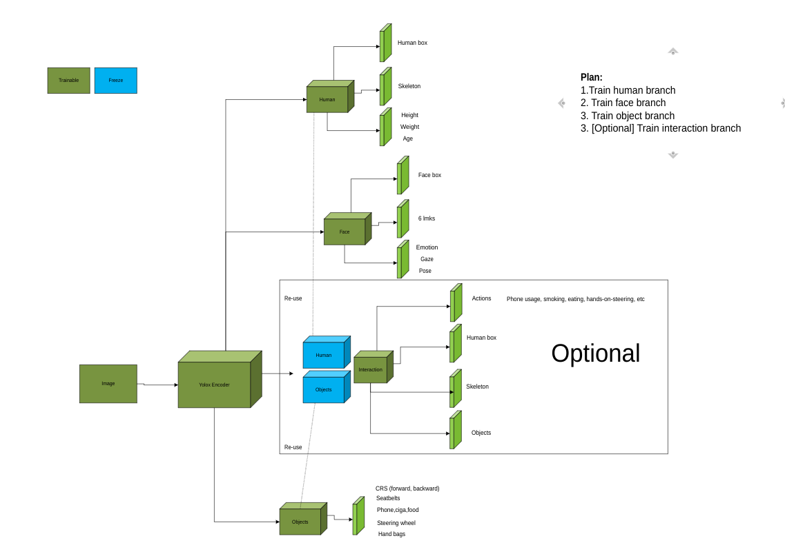

## Training Multitask for OMS



## Ideas:
There are 3 main branches:
- `Human` branch will detect **bodybox, skeleton, body-related biometry such as height/weight/age**
- `Face` branch will detect **facebox, 6-landmarks, face-related biometry such as emotion/age/gaze/eyestate**
- `Object` branch will detect objects
- [Optional] `Interaction` branch will detect Human-Object-Interaction (HOI)

## Training
### Training strategies
- [x] `Batch sampling` : each batch have only 1 task   
- [] `Mixed-Batch sampling`: each batch contains all tasks
- [] `Unified`: each sample contains all tasks

### Model
Defined in `yolox/models/yolox_oms.py`

### Trainer
Defined in `yolox/core/trainer_oms.py`

### Scripts
- Training
```
bash train_oms.sh
```

- Tensorboard
```
tensorboard --logdir YOLOX_outputs/tensorboard
```
